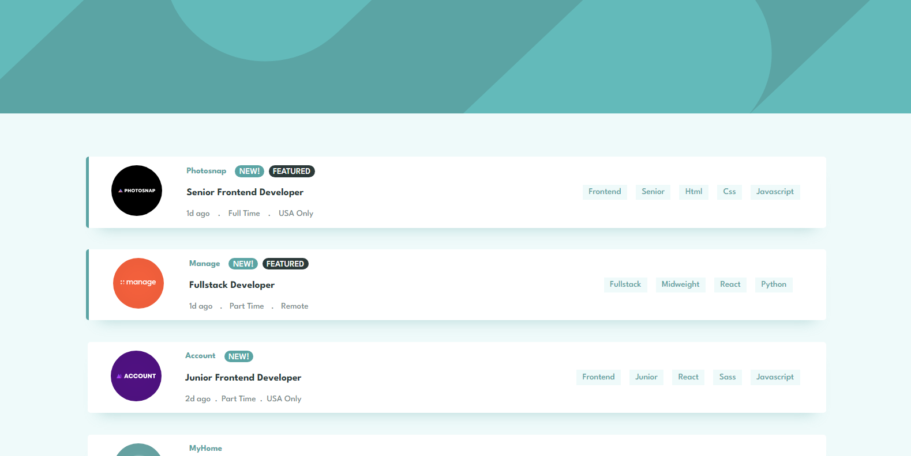

# Frontend Mentor - Job listings with filtering solution

This is a solution to the [Job listings with filtering challenge on Frontend Mentor](https://www.frontendmentor.io/challenges/job-listings-with-filtering-ivstIPCt). Frontend Mentor challenges help you improve your coding skills by building realistic projects.

## Table of contents

- [Overview](#overview)
  - [The challenge](#the-challenge)
  - [Screenshot](#screenshot)
  - [Links](#links)
- [My process](#my-process)
  - [Built with](#built-with)
  - [What I learned](#what-i-learned)
  - [Useful resources](#useful-resources)
- [Author](#author)

## Overview

### The challenge

Users should be able to:

- View the optimal layout for the site depending on their device's screen size
- See hover states for all interactive elements on the page
- Filter job listings based on the categories

### Screenshot



### Links

- Solution URL: [Add solution URL here](https://www.frontendmentor.io/solutions/job-filtering-list-9HZmcyb_A8)
- Live Site URL: [Add live site URL here](https://superb-hotteok-e84f4d.netlify.app/)

# My Process

### Built with

- JavaScript
- CSS
  - Flexbox
  - Grid
- [React](https://reactjs.org/) - JS library
- [Recoil](https://recoiljs.org/) - JS library
- [Ramda](https://ramdajs.com/) - JS library

### What I learned

How use recoil state mangement with sharabled state without flux
To see how you can add code snippets, see below:

```jsx
const darkThemeAtom = atom({
    key: "darkTheme",
    default: false,
})

// component 1

const [darkTheme, setDarkTheme } = useRecoilState(darkThemeAtom)

// component 2

const darkTheme = useRecoilValue(darkThemeAtom)
```

### Useful resources

- [Learn Recoil](https://learnrecoil.com/course) - This helped me for learn recoil.

## Author

- Website - [Jean Pierre Ortiz Murcia](coffejeancode.vercel.app)
- Frontend Mentor - [@CoffeJeanCode](https://www.frontendmentor.io/profile/CoffeJeanCode)
- Github - [@CoffeJeanCode](https://github.com/CoffeJeanCode)
